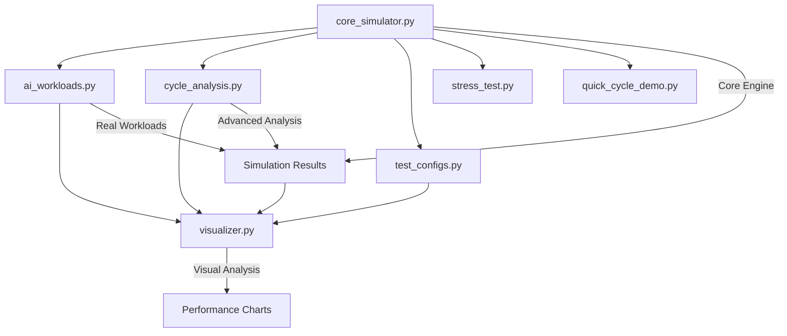

# 📚 AI CPU Simulator - Codebase Documentation

This document provides detailed explanations of each file in the AI CPU Simulator codebase, including their purpose, key classes/functions, and how they work together.

## 🏗️ Architecture Overview

The AI CPU Simulator is built with a modular architecture that separates concerns:

- **Core Simulation Engine** (`core_simulator.py`) - Main simulation logic
- **AI Workload Modeling** (`ai_workloads.py`) - Real-world AI task profiles  
- **Advanced Analysis** (`cycle_analysis.py`) - Cycle control and deep analysis
- **Performance Testing** (`test_configs.py`, `stress_test.py`) - Validation and testing
- **Visualization** (`visualizer.py`) - Performance charts and graphs
- **Quick Demos** (`quick_cycle_demo.py`) - Interactive demonstrations

---

## 📁 File-by-File Documentation

### 🔧 `core_simulator.py` - Main Simulation Engine
**Purpose**: Core heterogeneous CPU simulation with P-cores and E-cores

**Key Classes**:
- `Task` - Represents computational workloads with difficulty levels
- `Core` - Models individual CPU cores (Performance or Efficiency)
- `CPUSimulator` - Main simulation controller

**Key Features**:
- Heterogeneous core modeling (P-cores: 1.5x speed, 1.33x energy; E-cores: 1.0x speed, 1.0x energy)
- Intelligent task assignment based on difficulty thresholds
- Fallback logic for optimal core utilization
- Cycle-accurate execution with energy tracking

**Recent Fixes Applied**:
- ✅ Fixed missing `Task.remaining` initialization
- ✅ Fixed incomplete `run_cycle()` method
- ✅ Added advanced fallback logic for better core utilization
- ✅ Fixed malformed task list in main section

**Usage Example**:
```python
from core_simulator import CPUSimulator

tasks = [("TranscribeDebate", 5), ("RenderQuiz", 2)]
sim = CPUSimulator(tasks, num_perf=2, num_eff=2)
sim.run_simulation()
print(f"Completed in {sim.cycle} cycles")
```

---

### 🤖 `ai_workloads.py` - Real AI Workload Modeling
**Purpose**: Models realistic AI workloads for EdTech applications with actual performance characteristics

**Key Classes**:
- `AIWorkloadProfiler` - Profiles and models real AI workloads

**Key Features**:
- Real AI workload database (GPT-3.5, GPT-4, BERT, YOLO, etc.)
- EdTech-specific scenarios (essay grading, tutoring, transcription)
- Realistic latency and difficulty modeling
- Multiple workload scenarios (daily operations, real-time, research)

**AI Workloads Included**:
- **Language Models**: GPT-3.5-Turbo, GPT-4-Reasoning, Claude-3-Analysis, BERT-Sentiment
- **Computer Vision**: YOLO-ObjectDetection, ResNet-ImageClassify, StyleGAN-Generation
- **Speech & Audio**: Whisper-Large-V3, TTS-ElevenLabs, AudioSeparation
- **EdTech Specific**: EssayGrading-AI, MathSolver-WolframAlpha, PersonalizedTutor

**Usage Example**:
```python
from ai_workloads import AIWorkloadProfiler

# Create realistic EdTech workload
tasks = AIWorkloadProfiler.create_realistic_edtech_workload()
results = run_ai_workload_comparison()
```

---

### 📊 `cycle_analysis.py` - Advanced Cycle Control & Analysis
**Purpose**: Extended simulation capabilities with cycle control and deep performance analysis

**Key Classes**:
- `CycleControlledSimulator` - Extended simulator with cycle control features

**Key Features**:
- Maximum cycle limits with completion tracking
- Silent mode operation for batch testing
- Remaining work estimation algorithms
- Pattern analysis across different configurations
- Massive workload scalability testing

**Key Functions**:
- `run_for_max_cycles()` - Run simulation with cycle constraints
- `analyze_cycle_patterns()` - Compare configurations across scenarios
- `cycle_limit_experiment()` - Test cycle constraint effects
- `massive_workload_test()` - Scale testing up to 500+ tasks

**Usage Example**:
```python
from cycle_analysis import CycleControlledSimulator

sim = CycleControlledSimulator(tasks, 2, 2)
result = sim.run_for_max_cycles(max_cycles=10, silent=False)
print(f"Completion rate: {result['completion_rate']:.1f}%")
```

---

### 🧪 `test_configs.py` - Configuration Comparison Testing
**Purpose**: Systematic testing of different CPU configurations for performance comparison

**Key Features**:
- Standardized test workload for fair comparison
- Multiple configuration scenarios
- Performance and energy metrics collection
- Automated result comparison and ranking

**Configurations Tested**:
- Performance Heavy (4P + 0E) - Maximum processing speed
- Efficiency Heavy (0P + 4E) - Maximum battery life
- Balanced (2P + 2E) - Optimal for most scenarios
- Efficiency Focus (1P + 3E) - Extended battery usage
- Performance Focus (3P + 1E) - Fast processing priority

**Usage Example**:
```bash
python3 test_configs.py
# Automatically tests all configurations and provides comparison summary
```

---

### 🚨 `stress_test.py` - Edge Case & Stress Testing
**Purpose**: Validates simulator robustness under extreme conditions and edge cases

**Test Scenarios**:
- **Only Heavy Tasks** - All tasks above difficulty threshold
- **Only Light Tasks** - All tasks below difficulty threshold  
- **Many Small Tasks** - 20+ tiny tasks testing queue management
- **Few Huge Tasks** - Massive tasks testing long-running scenarios
- **High Threshold** - Testing threshold boundary conditions
- **Extreme Configurations** - 8+ cores testing scalability

**Key Features**:
- Edge case validation
- Stress testing with extreme workloads
- Configuration boundary testing
- Robustness verification

**Usage Example**:
```bash
python3 stress_test.py
# Runs all stress tests automatically
```

---

### 📈 `visualizer.py` - Performance Visualization Suite
**Purpose**: Professional visualization of simulation results with comprehensive charts and analysis

**Key Classes**:
- `CPUSimulatorVisualizer` - Professional visualization suite

**Key Features**:
- Cycles vs Energy scatter plots
- Energy efficiency bar charts  
- Scalability analysis line plots
- Performance heatmaps
- Professional styling with seaborn integration
- High-resolution output (300 DPI)

**Visualization Types**:
1. **Scatter Plot**: Cycles vs Energy by Configuration
2. **Bar Chart**: Energy Efficiency by Workload Scenario
3. **Line Plot**: Scalability Analysis (different workload sizes)
4. **Heatmap**: Performance Matrix (cycles across configurations)

**Dependencies**:
- matplotlib (for plotting)
- seaborn (for professional styling)
- numpy (for data processing)

**Usage Example**:
```python
from visualizer import CPUSimulatorVisualizer

viz = CPUSimulatorVisualizer()
viz.plot_cycles_vs_energy(save_path="analysis.png")
```

---

### 🎮 `quick_cycle_demo.py` - Interactive Demonstrations
**Purpose**: Quick, focused demonstrations of different cycle scenarios and simulation capabilities

**Key Features**:
- Normal completion scenarios
- Limited cycle scenarios with partial completion
- Excess cycle scenarios showing efficiency
- Side-by-side configuration comparisons
- Interactive examples for learning

**Demo Scenarios**:
1. **Normal Scenario** - Standard task completion
2. **Limited Cycles** - What happens with insufficient cycles
3. **Excess Cycles** - Efficiency with too many cycles
4. **Efficiency Comparison** - Direct configuration comparison

**Usage Example**:
```bash
python3 quick_cycle_demo.py
# Runs all demonstration scenarios with explanations
```

---

## 🔄 How Files Work Together



## 🚀 Getting Started

1. **Basic Simulation**: Start with `core_simulator.py`
2. **Real Workloads**: Use `ai_workloads.py` for realistic scenarios
3. **Performance Testing**: Run `test_configs.py` for comparisons
4. **Advanced Analysis**: Use `cycle_analysis.py` for deep insights
5. **Visualization**: Generate charts with `visualizer.py`
6. **Learning**: Try `quick_cycle_demo.py` for interactive examples

## 📊 Performance Improvements Made

### Before Bug Fixes:
- Balanced (2P + 2E): 11 cycles, 40.91 energy
- Efficiency Focus (1P + 3E): 20 cycles, 40.91 energy
- Poor core utilization with idle efficiency cores

### After Bug Fixes:
- Balanced (2P + 2E): 8 cycles, 37.94 energy ✅ **(-3 cycles, -2.97 energy)**
- Efficiency Focus (1P + 3E): 10 cycles, 35.30 energy ✅ **(-10 cycles, -5.61 energy)**
- Optimal core utilization with smart fallback logic

## 🔧 Technical Architecture

### Core Design Principles:
- **Modularity**: Each file has a specific, well-defined purpose
- **Extensibility**: Easy to add new workloads, configurations, or analysis
- **Robustness**: Comprehensive testing with edge cases and stress scenarios
- **Performance**: Optimized algorithms with efficient core assignment logic
- **Visualization**: Professional charts for insights and presentation

### Key Algorithms:
- **Task Assignment**: Difficulty-based queue management with fallback logic
- **Core Simulation**: Cycle-accurate processing with energy tracking
- **Load Balancing**: Cross-type assignment when preferred cores are busy
- **Performance Analysis**: Multi-dimensional comparison across configurations